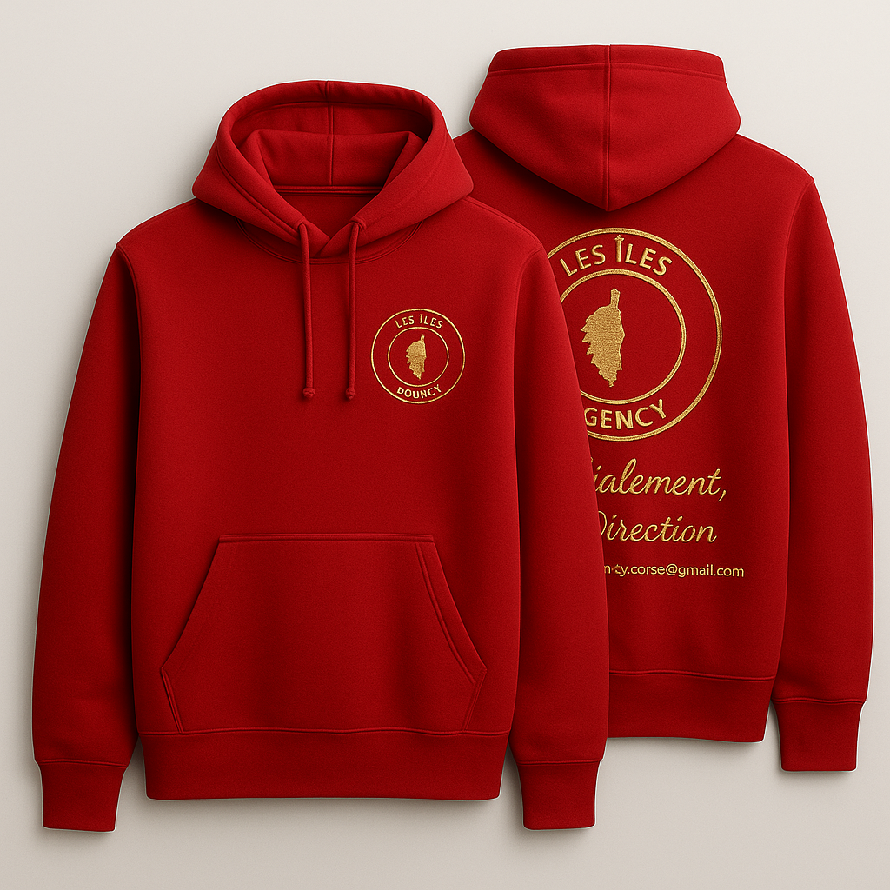
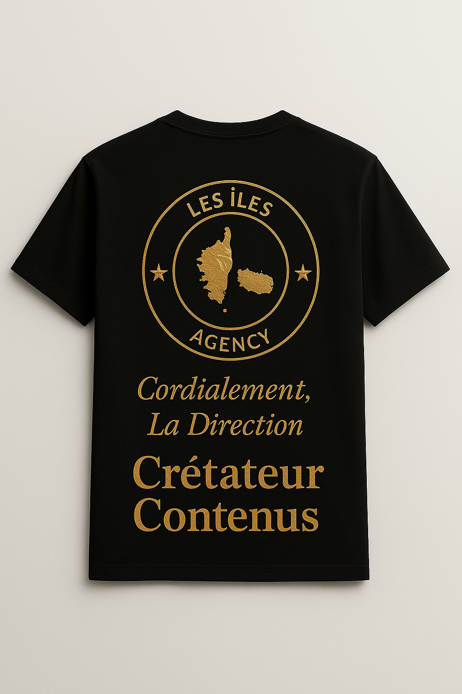
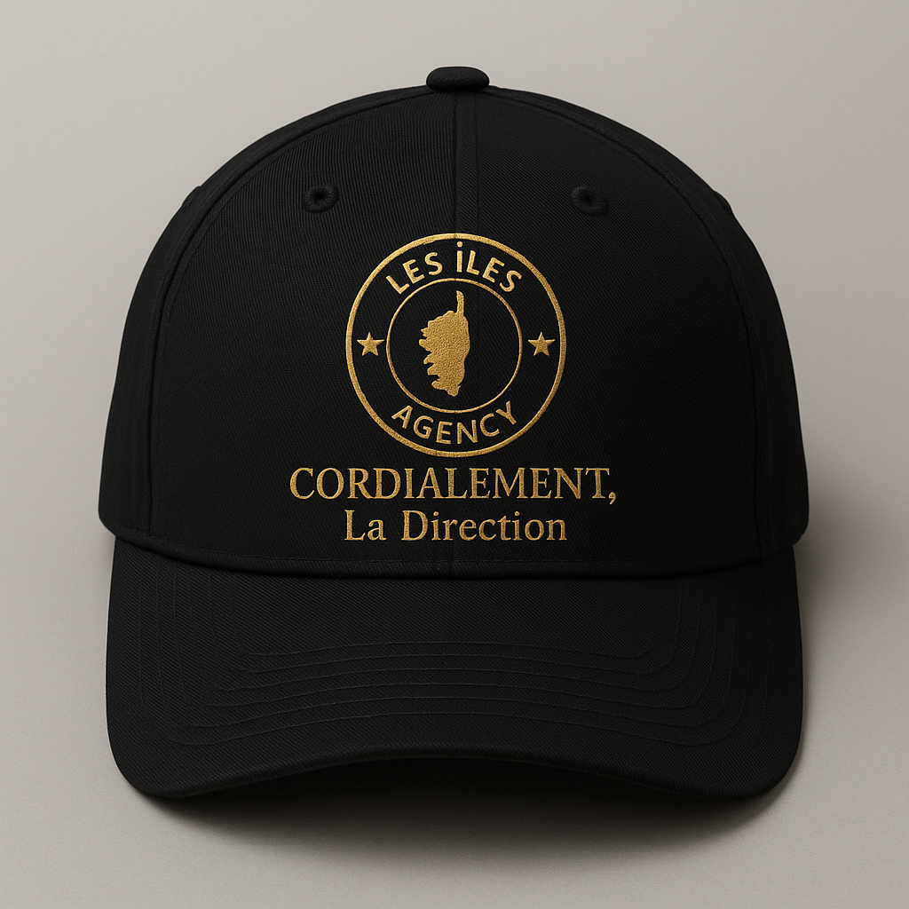
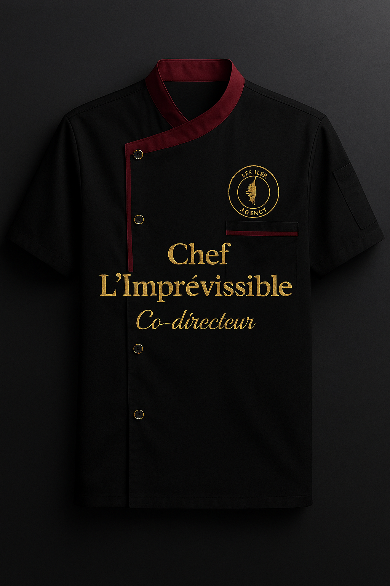
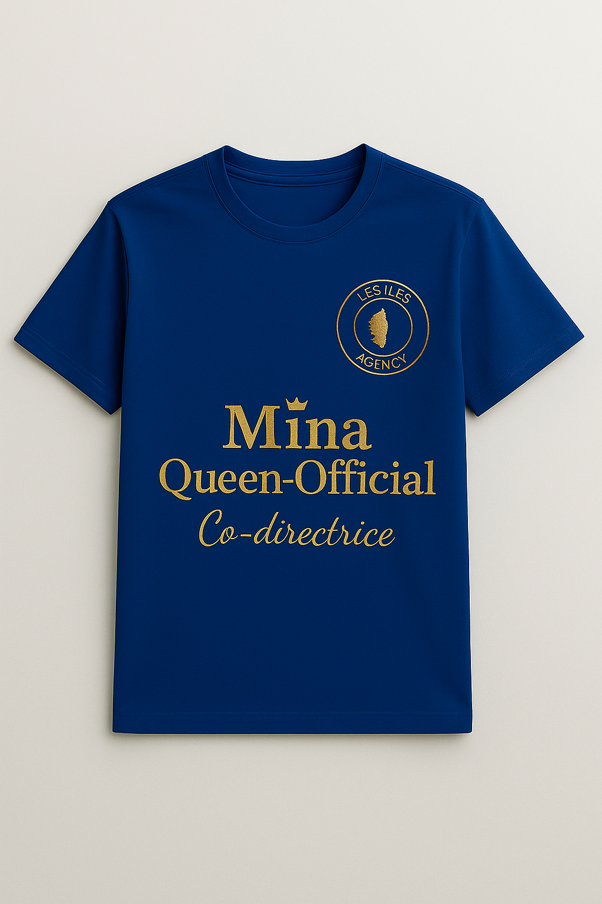

<!DOCTYPE html>
<html lang="fr">
<head>
  <meta charset="UTF-8" />
  <meta name="viewport" content="width=device-width, initial-scale=1.0" />
  <title>LES ÎLES AGENCY — Collection Officielle 2025</title>
  
</head>

<body>
  <header>
    
    <nav>
      <a href="#boutique">Boutique</a>
      <a href="#apropos">À propos</a>
      <a href="#contact">Contact</a>
    </nav>
  </header>

  <section class="hero">
    <h1>LES ÎLES AGENCY 2025</h1>
    
La fierté des îles, l'élégance à ton image 🌴

    <button onclick="window.location.href='#boutique'">Découvrir la collection</button>
  </section>

  <section id="boutique" class="boutique">
    <h2>Boutique Officielle</h2>
    

      

        
        <h3>Sweat Rouge</h3>
        
Édition 2025 – Style Îles Agency

      

      

        
        <h3>Créa Noir & Or</h3>
        
Élégance dorée, 100% authenticité

      

      

        
        <h3>Casquette Noir</h3>
        
Un style unique signé Les Îles

      

      

        
        <h3>Chemise Noir</h3>
        
Classe tropicale et raffinée

      

      

        
        <h3>Mina Queen Official</h3>
        
Collection Reine des Îles 2025

      

    

    <!-- 🔽 Début de la section personnalisation 🔽 -->

  <h3 style="color: gold;">Personnalise ton article 👕</h3>

  <!-- Taille -->
  <label for="taille" style="display:block; margin-top:10px;">Taille :</label>
  <select id="taille" style="padding:8px; border-radius:8px; margin-top:5px;">
    <option value="S">S</option>
    <option value="M">M</option>
    <option value="L">L</option>
    <option value="XL">XL</option>
  </select>

  <!-- Couleur -->
  <label for="couleur" style="display:block; margin-top:10px;">Couleur :</label>
  <select id="couleur" style="padding:8px; border-radius:8px; margin-top:5px;">
    <option value="noir">Noir</option>
    <option value="blanc">Blanc</option>
    <option value="or">Or</option>
  </select>

  <!-- Texte personnalisé -->
  <label for="perso" style="display:block; margin-top:10px;">Texte personnalisé (facultatif) :</label>
  <input id="perso" type="text" placeholder="Ex : Reine des Îles 👑" 
         style="padding:8px; border-radius:8px; width:80%; margin-top:5px; border:1px solid gold; background:rgba(255,255,255,0.1); color:white;">

  <!-- Bouton commander -->
  <button 
    onclick="window.open('https://paypal.me/lesilesagency','_blank')" 
    style="margin-top:20px; background:gold; color:black; border:none; padding:12px 25px; border-radius:25px; font-weight:bold; cursor:pointer; box-shadow:0 0 15px gold; transition:all 0.3s;">
    💳 Commander via PayPal
  </button>

<!-- 🔼 Fin de la section personnalisation 🔼 -->

  

    
Ou scanne ce QR code :

    
  

    

  </section>
<section id="apropos" style="padding: 60px 20px; text-align: center; color: white;">
  <h2 style="color: gold; font-size: 2em; margin-bottom: 10px;">À propos</h2>
  

    <b>LES ÎLES AGENCY</b> est une marque née de la passion des îles et de l’élégance tropicale.
    Notre mission est de mettre en avant la fierté et le style unique des îles
    à travers des collections modernes, authentiques et haut de gamme.
    Chaque création représente l’esprit, la chaleur et la beauté des îles 🌺.
  

</section>

<section id="contact" style="padding: 60px 20px; text-align: center; color: white;">
  <h2 style="color: gold; font-size: 2em; margin-bottom: 10px;">Contact</h2>
  
📩 Email :
    <a href="mailto:les.iles.agency.corse@gmail.com" style="color: gold; text-decoration: none;">
      les.iles.agency.corse@gmail.com
    </a>
  

  
📍 Basée à <b>La Réunion</b> — disponible dans toute la France et les DOM 🇫🇷

</section>
  <footer>
    © 2025 LES ÎLES AGENCY — Tous droits réservés
  </footer>
</body>
</html>
