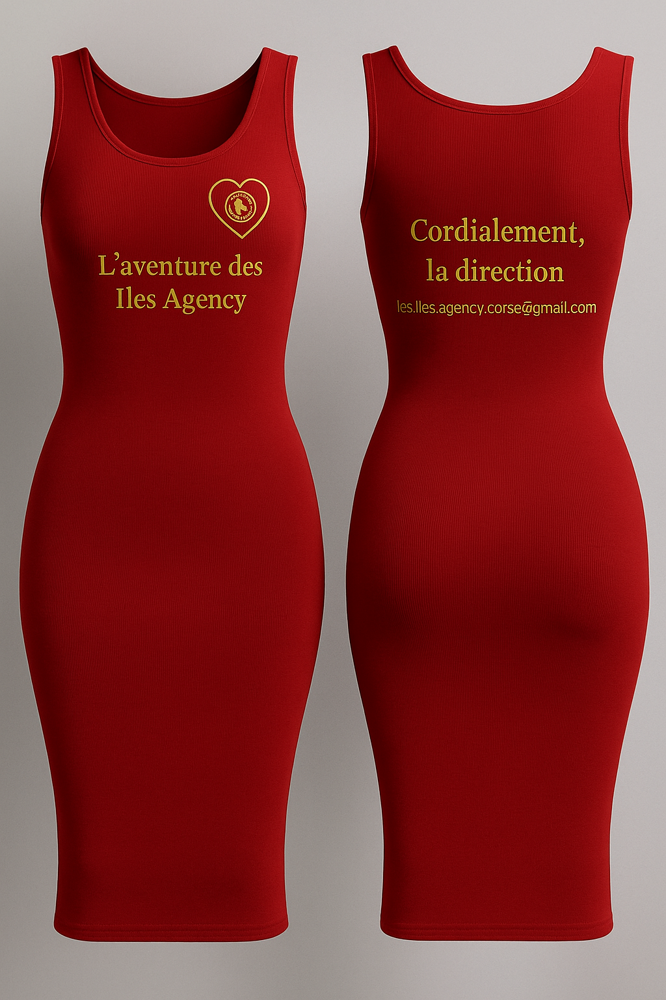

<!DOCTYPE html>
<html lang="fr">
<head>
  <meta charset="UTF-8" />
  <meta name="viewport" content="width=device-width, initial-scale=1.0" />
  <title>LES ÎLES AGENCY — Collection Officielle 2025</title>
  
</head>
<body>
  <header>
    
    <nav>
      <a href="#boutique">Boutique</a>
      <a href="#flocage">À propos</a>
      <a href="#contact">Contact</a>
    </nav>
  </header>

  <main class="wrap">
    <!-- HERO -->
    <section class="hero">
      <h1>LES ÎLES AGENCY 2025</h1>
      
La fierté des îles, l’élégance à ton image 🌴

      <a href="#boutique" class="btn">Découvrir la collection</a>
    </section>

    <!-- BOUTIQUE -->
    <section id="boutique">
      <h2 class="section-title">Boutique Officielle</h2>

      

        <!-- Sweat rouge -->
        <article class="card">
          
          <h3>Sweat Rouge</h3>
          49,99 €
          

  <a class="btn" href="https://www.paypal.com/ncp/payment/SF5MU7HEKJD24" target="_blank">
    Commander
  </a>

        </article>

        <!-- Créa noir & or -->
        <article class="card">
          
          <h3>Créa Noir & Or</h3>
          14,99 €
          

  <a class="btn" href="https://www.paypal.com/ncp/payment/JPJQCQ6W3FJC2" target="_blank">
    Commander
  </a>

        </article>

        <!-- Casquette noir -->
        <article class="card">
          
          <h3>Casquette Noir</h3>
          17,99 €
          

  <a class="btn" href="https://www.paypal.com/ncp/payment/9DFPFZUZG35Z4" target="_blank">
    Commander
  </a>

        </article>

        <!-- Chemise cuisinier -->
        <article class="card">
          
          <h3>Chemise Cuisinier</h3>
          59,99 €
          

  <a class="btn" href="https://www.paypal.com/ncp/payment/AGHJTXLTEWWUA" target="_blank">
    Commander
  </a>

<!-- === ROBE LOVENCY === -->
<article class="card">
  
  <h3>Robe Lovency</h3>
  34,99 €
  
Robe moulante rouge – design exclusif Les Îles Agency

<!-- APERÇU ROBE LOVENCY -->

  
  <!-- Petit logo côté cœur -->
  
  <!-- Texte sous le logo -->
  
L’aventure des Îles Agency

  <!-- Slogan dos (affiché sous la robe en aperçu simple) -->
  
Cordialement, la Direction – les.iles.agency.corse@gmail.com

  <!-- Options -->
  

    <label for="taille-lovency">Taille :</label>
    <select id="taille-lovency">
      <option>S</option>
      <option>M</option>
      <option>L</option>
      <option>XL</option>
      <option>XXL</option>
    </select>

    <label for="couleur-lovency">Couleur :</label>
    <select id="couleur-lovency">
      <option>Rouge</option>
      <option>Noir</option>
      <option>Blanc</option>
      <option>Bleu</option>
      <option>Jaune</option>
    </select>

    <label for="texte-lovency">Texte personnalisé (facultatif) :</label>
    <input type="text" id="texte-lovency" placeholder="Ex: Reine des Îles">
  

  

    <button class="btn" onclick="ouvrirPaiementLovency()">Commander</button>
  

</article>

        <!-- Mina Queen (si tu veux plus tard ajouter un prix) -->
        <article class="card">
          
          <h3>Mina Queen Official</h3>
          
Collection Reine des Îles 2025.

        </article>
      

      

        <button class="btn" onclick="ouvrirPaiement()">💳 Commander via PayPal</button>
        
Le résumé de ta commande est copié automatiquement. Colle-le en note dans PayPal.

      

    </section>

    <!-- PERSONNALISATION / FLOCAGE -->
    <section id="flocage">
      <h2 class="section-title">Personnalise ton flocage</h2>

      

        

          

            <label for="taille">Taille</label>
            <select id="taille">
              <option value="3 ans">3 ans</option>
              <option value="4 ans">4 ans</option>
              <option value="6 ans">6 ans</option>
              <option value="8 ans">8 ans</option>
              <option value="10 ans">10 ans</option>
              <option value="12 ans">12 ans</option>
              <option value="14 ans">14 ans</option>
              <option value="XS">XS</option>
              <option value="S" selected>S</option>
              <option value="M">M</option>
              <option value="L">L</option>
              <option value="XL">XL</option>
              <option value="XXL">XXL</option>
              <option value="3XL">3XL</option>
            </select>
          

          

            <label for="couleur">Couleur</label>
            <select id="couleur">
              <option value="Blanc" selected>Blanc</option>
              <option value="Noir">Noir</option>
              <option value="Rouge">Rouge</option>
              <option value="Bleu">Bleu</option>
              <option value="Rose">Rose</option>
              <option value="Or">Or</option>
            </select>
          

          

            <label for="texte">Texte personnalisé (facultatif)</label>
            <input id="texte" type="text" placeholder="Ex : Reine des Îles 👑">
          

        

        

          

          
Choisis une couleur puis un style de flocage :

        

        

          

LES ÎLES

          

LES ÎLES

          

LES ÎLES

        

        

          <button class="btn" onclick="ouvrirPaiement(true)">✨ Créer mon flocage & Payer</button>
        

      

    </section>

    <!-- CONTACT -->
    <section id="contact">
      <h2 class="section-title">Contact</h2>
      

        
Une question ? Écris-nous : <a href="mailto:les.iles.agency.corse@gmail.com">les.iles.agency.corse@gmail.com</a>

        
Tu peux aussi préciser ta taille/couleur/texte directement par email après paiement.

      

    </section>
  </main>

  <footer>© 2025 LES ÎLES AGENCY — Tous droits réservés</footer>

  
</body>
</html>
