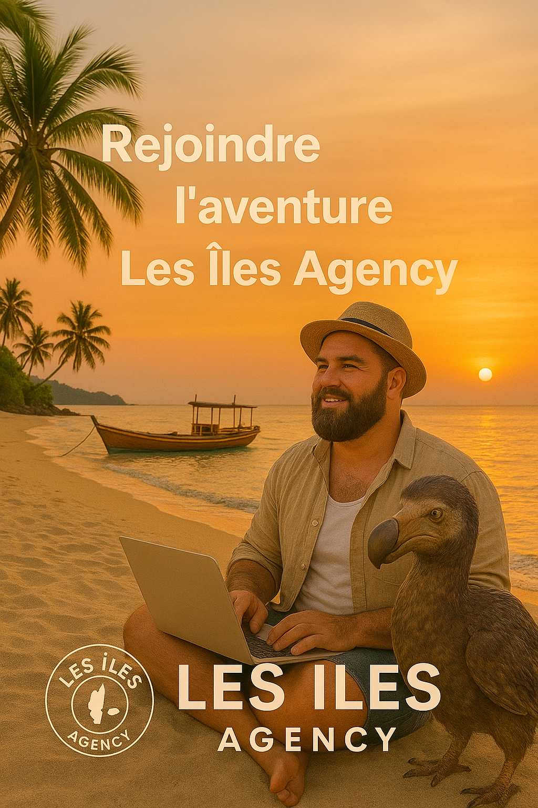

<!DOCTYPE html>
<html lang="fr">
<head>
  <meta charset="UTF-8">
  <meta name="viewport" content="width=device-width, initial-scale=1.0">
  <title>LES ÎLES AGENCY — Boutique officielle</title>
  
</head>
<body>

  <header>
    
    <nav>
      <a href="#boutique">Boutique</a>
      <a href="#a-propos">À propos</a>
      <a href="#contact">Contact</a>
    </nav>
  </header>

  <section class="hero">
    <h1>LES ÎLES AGENCY 2025</h1>
    <h2>La fierté des îles, l’élégance à ton image</h2>
    <button onclick="window.location.href='#boutique'">Découvrir la collection</button>
  </section>

  <section id="boutique" class="boutique">
    <h2>Boutique Officielle</h2>
    

      

        
        <h3>Sweat Rouge</h3>
        
Édition 2025 – Style Îles Agency

      

      

        
        <h3>Créa Noir & Or</h3>
        
Élégance dorée, 100% authenticité

      

      

        
        <h3>Casquette Noir</h3>
        
Un style unique signé Les Îles

      

      

        
        <h3>Chemise Noir</h3>
        
Classe tropicale et raffinée

      

      

        
        <h3>Mina Queen Official</h3>
        
Collection Reine des Îles 2025

      

    

    

      <a href="https://www.paypal.com/paypalme/fondateurilesacencylivecuisto" target="_blank">
        💳 Commander via PayPal
      </a>
    

  </section>

  <footer>
    © 2025 LES ÎLES AGENCY — Tous droits réservés
  </footer>

</body>
</html>
